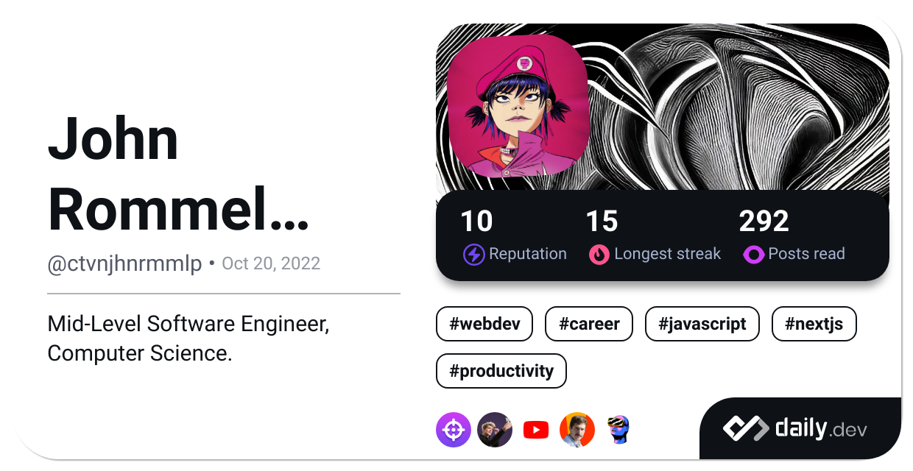

<a href="https://github.com/ctvnjhnrmmlp">
  <picture>
    <source srcset="https://komarev.com/ghpvc/?username=ctvnjhnrmmlp&label=Profile%20views&color=1e90ff&style=flat" type="image/svg+xml">
    
  </picture>
</a>

<a href="https://user-badge.committers.top/philippines_private/ctvnjhnrmmlp">
  <picture>
    <source srcset="https://user-badge.committers.top/philippines_private/ctvnjhnrmmlp.svg" type="image/svg+xml">
    
  </picture>
<a>

<a href="https://leetcode.com/ctvnjhnrmmlp">
  <picture>
    <source srcset="https://img.shields.io/badge/dynamic/json?style=flat&labelColor=black&color=%23ffa116&label=Ranking&query=ranking&url=https%3A%2F%2Fleetcode-badge.vercel.app%2Fapi%2Fusers%2Fctvnjhnrmmlp&logo=leetcode&logoColor=yellow" type="image/svg+xml">
    
  </picture>
<a>

```
                
                     ██╗ ██████╗ ██╗  ██╗███╗   ██╗    ██████╗  ██████╗ ███╗   ███╗███╗   ███╗███████╗██╗     
                     ██║██╔═══██╗██║  ██║████╗  ██║    ██╔══██╗██╔═══██╗████╗ ████║████╗ ████║██╔════╝██║     
                     ██║██║   ██║███████║██╔██╗ ██║    ██████╔╝██║   ██║██╔████╔██║██╔████╔██║█████╗  ██║     
                ██   ██║██║   ██║██╔══██║██║╚██╗██║    ██╔══██╗██║   ██║██║╚██╔╝██║██║╚██╔╝██║██╔══╝  ██║     
                ╚█████╔╝╚██████╔╝██║  ██║██║ ╚████║    ██║  ██║╚██████╔╝██║ ╚═╝ ██║██║ ╚═╝ ██║███████╗███████╗
                 ╚════╝  ╚═════╝ ╚═╝  ╚═╝╚═╝  ╚═══╝    ╚═╝  ╚═╝ ╚═════╝ ╚═╝     ╚═╝╚═╝     ╚═╝╚══════╝╚══════╝
                                                                                                                        
                           ██████╗  ██████╗████████╗ █████╗ ██╗   ██╗██╗ █████╗ ███╗   ██╗ ██████╗                      
                          ██╔═══██╗██╔════╝╚══██╔══╝██╔══██╗██║   ██║██║██╔══██╗████╗  ██║██╔═══██╗                     
                          ██║   ██║██║        ██║   ███████║██║   ██║██║███████║██╔██╗ ██║██║   ██║                     
                          ██║   ██║██║        ██║   ██╔══██║╚██╗ ██╔╝██║██╔══██║██║╚██╗██║██║   ██║                     
                          ╚██████╔╝╚██████╗   ██║   ██║  ██║ ╚████╔╝ ██║██║  ██║██║ ╚████║╚██████╔╝                     
                           ╚═════╝  ╚═════╝   ╚═╝   ╚═╝  ╚═╝  ╚═══╝  ╚═╝╚═╝  ╚═╝╚═╝  ╚═══╝ ╚═════╝                      
  
                   ________  ________  ________ _________  ___       __   ________  ________  _______          
                  |\   ____\|\   __  \|\  _____\\___   ___\\  \     |\  \|\   __  \|\   __  \|\  ___ \         
                  \ \  \___|\ \  \|\  \ \  \__/\|___ \  \_\ \  \    \ \  \ \  \|\  \ \  \|\  \ \   __/|        
                   \ \_____  \ \  \\\  \ \   __\    \ \  \ \ \  \  __\ \  \ \   __  \ \   _  _\ \  \_|/__      
                    \|____|\  \ \  \\\  \ \  \_|     \ \  \ \ \  \|\__\_\  \ \  \ \  \ \  \\  \\ \  \_|\ \     
                      ____\_\  \ \_______\ \__\       \ \__\ \ \____________\ \__\ \__\ \__\\ _\\ \_______\    
                     |\_________\|_______|\|__|        \|__|  \|____________|\|__|\|__|\|__|\|__|\|_______|    
                     \|_________|                                                                             
                           _______   ________   ________  ___  ________   _______   _______   ________                 
                          |\  ___ \ |\   ___  \|\   ____\|\  \|\   ___  \|\  ___ \ |\  ___ \ |\   __  \                
                          \ \   __/|\ \  \\ \  \ \  \___|\ \  \ \  \\ \  \ \   __/|\ \   __/|\ \  \|\  \               
                           \ \  \_|/_\ \  \\ \  \ \  \  __\ \  \ \  \\ \  \ \  \_|/_\ \  \_|/_\ \   _  _\              
                            \ \  \_|\ \ \  \\ \  \ \  \|\  \ \  \ \  \\ \  \ \  \_|\ \ \  \_|\ \ \  \\  \|             
                             \ \_______\ \__\\ \__\ \_______\ \__\ \__\\ \__\ \_______\ \_______\ \__\\ _\             
                              \|_______|\|__| \|__|\|_______|\|__|\|__| \|__|\|_______|\|_______|\|__|\|__|            
                                                                                               
```

<a href="https://github.com/ctvnjhnrmmlp">
  <picture>
    <source srcset="http://github-profile-summary-cards.vercel.app/api/cards/profile-details?username=ctvnjhnrmmlp&theme=github_dark" type="image/svg+xml" width="100%" />
    
  </picture>
</a>

<a href="https://roadmap.sh/u/ctvnjhnrmmlp">
  <picture>
    <source srcset="https://roadmap.sh/card/wide/65c838d8d789a518cf266ad6?variant=dark&roadmaps=software-design-architecture%2Cfull-stack%2Cblockchain%2Cbackend" type="image/svg+xml" />
    
  </picture>
</a>

<a href="https://app.daily.dev/ctvnjhnrmmlp">
  <picture>
    <source srcset="./devcard.png" type="image/svg+xml" width="100%" />
    
  </picture>
</a>


